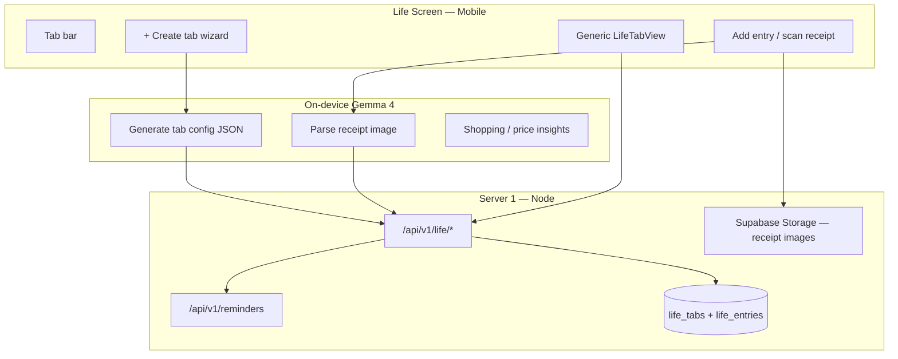
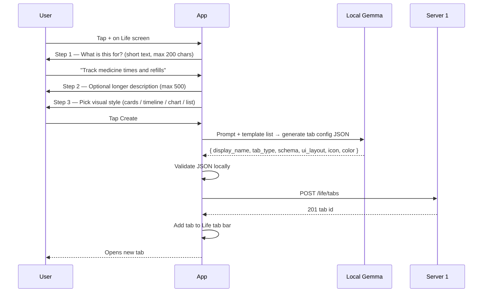
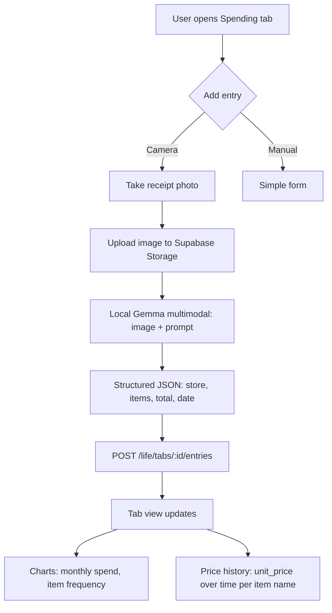

# Life Screen — Custom Tabs & Structured Trackers (Feature Plan)

**Version:** 1.0  
**Status:** Planning — ship before email integrations  
**Last updated:** 2026-06-08  

**Related:**
- Reminders (permanent tab): [`MOBILE_REMINDERS_UI_SPEC.md`](MOBILE_REMINDERS_UI_SPEC.md)
- Server APIs today: [`SERVER1_API_CATALOG.md`](SERVER1_API_CATALOG.md)
- Agent tools pattern: [`REMINDERS_AGENT_TOOL_SPEC.md`](REMINDERS_AGENT_TOOL_SPEC.md)

---

## 0. Reminders pre-flight test results (2026-06-08)

Before building Life tabs, reminders were verified against your live Supabase:

| Check | Result |
|---|---|
| `reminders` table in DB | ✅ 19 columns, migration applied |
| Create reminder (`source=user`) | ✅ Row inserted, `status=pending` |
| Fire pipeline (`fireRemindersNow`) | ✅ `processed:1`, `status→fired`, `fire_count:1` |
| `pg_cron` extension in Supabase | ✅ Enabled |
| `pg_cron` job scheduled | ❌ **Not configured yet** — you still need the SQL from `doc/step-06.md` |
| `pg_net` extension | ❓ Not confirmed — enable if using `net.http_post` |
| FCM on fire | ❌ `push_delivered=false` — placeholder `FCM_SERVICE_ACCOUNT_PATH` |
| Server 2 agent event | ❌ `agent_delivered=false` — `SERVER2_INTERNAL_URL` not set |
| node-cron fallback | ✅ Works when Server 1 process is running |

**Action before production:** Run pg_cron SQL in Supabase dashboard (see Section 12). Until then, reminders only fire while Server 1 is running.

---

## 1. Vision

The **Life** screen is the user’s personal control center:

```
┌─────────────────────────────────────────────────────────────┐
│  LIFE                                                       │
│  ┌──────────┬──────────┬──────────┬──────────┬─────┐       │
│  │ Reminders│ Medicine │ Spending │ Subs     │  +  │       │
│  │ (fixed)  │  tab 1   │  tab 2   │  tab 3   │     │       │
│  └──────────┴──────────┴──────────┴──────────┴─────┘       │
│                                                             │
│  [ Tab content — cards, timeline, charts, entries ]       │
└─────────────────────────────────────────────────────────────┘
```

| Tab type | Who creates | Stored where |
|---|---|---|
| **Reminders** | User / agent / UI | Existing `/api/v1/reminders` — **permanent, not counted in limit** |
| **Custom life tabs** | User via + wizard (+ local AI) | New `/api/v1/life/tabs` — **max 4 per user** |

Custom tabs are **not new React components per tab**. They are **data-driven**: one generic `LifeTabView` renderer reads `ui_layout` + `schema` from the server and paints the right UI.

---

## 2. Design principles

1. **Server = storage + structure validation** — no AI on Node server (matches your two-server split).
2. **On-device Gemma = intelligence at create time** — generates tab name, icon hint, field schema, chart type from user’s short description.
3. **Structured entries, not free-form notes** — every log line is JSON validated against the tab’s schema so agent tools stay reliable.
4. **Remindable** — any tab can optionally link to `/reminders` (medicine dose, subscription renewal, budget alert).
5. **Agent-ready** — stable CRUD APIs → function calling tools on device (Tier 1) or Server 2 later (Tier 2).
6. **Ship fast** — v1 uses **3 built-in templates** + optional “custom” with AI-generated schema; no open-ended plugin system yet.

---

## 3. Architecture



### Division of labour

| Step | Where |
|---|---|
| User describes “track medicine at 8am” | Mobile wizard |
| AI picks template, fields, chart, display name | **Local Gemma** |
| Save tab definition | **Server 1** |
| User snaps receipt photo | Mobile camera |
| AI extracts store, items, prices | **Local Gemma multimodal** |
| Save structured entry | **Server 1** |
| “Remind me before renewal” | Link `reminder_id` or `POST /reminders` |
| Monthly spend chart | Mobile reads entries + aggregates (or server summary endpoint) |

---

## 4. Tab limits & fixed Reminders tab

| Rule | Value |
|---|---|
| **Reminders tab** | Always visible — uses existing reminders module |
| **Custom tabs max** | **4 per user** |
| **Total visible tabs** | 1 fixed + up to 4 custom = **5 max** |
| **Archive** | Custom tabs can be archived (frees a slot) |

`POST /life/tabs` returns `422 TAB_LIMIT_REACHED` when user already has 4 active custom tabs.

---

## 5. Create-tab wizard (UI flow)



### Wizard fields (user input)

| Field | Required | Max | Notes |
|---|---|---|---|
| `purpose` | Yes | 200 chars | “What is this tracker for?” |
| `description` | No | 500 chars | Extra context for local AI |
| `ui_layout` | Yes | enum | `cards` · `timeline` · `chart` · `list` — user picks preferred look |

Local AI fills: `display_name`, `tab_type`, `schema`, `icon`, `color`, `settings`.

### Local AI prompt output (strict JSON)

App must parse this shape before calling server:

```json
{
  "display_name": "Medicine",
  "tab_type": "medicine",
  "ui_layout": "timeline",
  "icon": "pill",
  "color": "#4F46E5",
  "schema": {
    "entry_fields": [
      { "key": "medicine_name", "type": "string", "label": "Medicine", "required": true },
      { "key": "dose", "type": "string", "label": "Dose", "required": true },
      { "key": "taken_at", "type": "datetime", "label": "Taken at", "required": true },
      { "key": "notes", "type": "string", "label": "Notes", "required": false }
    ]
  },
  "settings": {
    "default_reminder_recurrence": "daily",
    "suggested_reminder_times": ["08:00", "20:00"]
  }
}
```

If Gemma returns invalid JSON → fall back to **manual template picker** (no AI).

---

## 6. Built-in templates (v1)

Ship 3 templates local AI must choose from (or `custom` with guardrails):

### 6.1 Medicine (`tab_type: medicine`)

**Use case:** Dose logging, refill tracking, link to daily reminders.

| Entry fields | `medicine_name`, `dose`, `taken_at`, `notes` |
| UI default | `timeline` |
| Reminder link | Suggest `POST /reminders` with `recurrence: daily` |

### 6.2 Subscriptions (`tab_type: subscriptions`)

**Use case:** Netflix, gym, SaaS — renewal dates, monthly cost.

| Entry fields | `service_name`, `amount`, `currency`, `billing_cycle`, `renewal_date`, `cancel_url` |
| UI default | `cards` |
| Reminder link | One-time reminder 3 days before `renewal_date` |

### 6.3 Spending (`tab_type: spending`)

**Use case:** Receipt capture, item-level history, monthly totals, price tracking.

| Entry fields | `store`, `total`, `currency`, `purchased_at`, `items[]`, `receipt_image_url` |
| `items[]` subfields | `name`, `qty`, `unit_price`, `category` |
| UI default | `chart` (monthly bar) + list |
| AI extras | Price history per product, “you bought milk 3x this month” |

### 6.4 Custom (`tab_type: custom`)

Local AI proposes `schema.entry_fields` (max **8 fields**, allowed types: `string`, `number`, `boolean`, `datetime`, `enum`). Server validates and rejects unsafe/overlarge schemas.

---

## 7. Spending / receipt flow (flagship example)



**Shopping assistant (on-device, no Server 2):**

```
User: "I'm going shopping"
Gemma + tool list_life_entries(tab=spending, last 90 days)
→ "You often buy milk, eggs, bread. Last milk price was $3.99 at Walmart."
```

**Price hike detection (client or server aggregate):**

```
GET /life/tabs/:id/insights?type=price_changes
→ [{ "item": "Milk", "prices": [{ "date", "unit_price", "store" }] }]
```

---

## 8. Database schema (Server 1)

### 8.1 `life_tabs`

```typescript
life_tabs {
  id:            uuid PK
  user_id:       uuid FK → users
  display_name:  varchar(60)      // "Medicine", "My Subs"
  slug:          varchar(60)      // url-safe unique per user
  purpose:       varchar(200)     // user’s short intent (wizard step 1)
  description:   text nullable
  tab_type:      varchar(30)      // medicine | subscriptions | spending | custom
  ui_layout:     varchar(20)      // cards | timeline | chart | list
  icon:          varchar(30)      // app icon key
  color:         varchar(7)       // hex
  schema:        jsonb            // entry_fields definition (validated)
  settings:      jsonb            // template-specific config
  position:      integer          // tab order 0–3
  status:        varchar(20)      // active | archived
  source:        varchar(20)      // user | agent
  created_at, updated_at
}

// Indexes: user_id, (user_id, status), unique (user_id, slug)
// Constraint: max 4 active tabs per user (app + DB check)
```

### 8.2 `life_entries`

```typescript
life_entries {
  id:            uuid PK
  user_id:       uuid FK
  tab_id:        uuid FK → life_tabs ON DELETE CASCADE
  data:          jsonb            // validated against tab.schema
  occurred_at:   timestamptz      // when event happened (purchase, dose, etc.)
  source:        varchar(20)      // user | agent | scan
  media_urls:    jsonb            // ["https://...receipt.jpg"]
  reminder_id:   uuid nullable FK → reminders
  created_at, updated_at
}

// Indexes: tab_id, user_id, occurred_at, GIN on data for item name search (spending)
```

### 8.3 Relationship to reminders

```
life_entries.reminder_id  →  optional link
reminders (no FK back)    →  use body/title to mention tab name, or add reminders.metadata jsonb later
```

**v1:** Create reminders separately; store `reminder_id` on entry when user enables “remind me too”.

**v2 (optional):** `reminders.metadata: { life_tab_id, life_entry_id }`.

---

## 9. API design — `/api/v1/life`

### 9.1 Tabs

| Method | Path | Auth | Purpose |
|---|---|---|---|
| GET | `/life/tabs` | User | List active tabs (custom only; Reminders tab is client-fixed) |
| POST | `/life/tabs` | User or Service | Create tab (wizard result) |
| GET | `/life/tabs/:id` | User | Tab detail + schema |
| PATCH | `/life/tabs/:id` | User or Service | Update display_name, position, settings |
| POST | `/life/tabs/:id/archive` | User | Archive tab (free slot) |
| DELETE | `/life/tabs/:id` | User | Hard delete tab + entries |

**POST /life/tabs body (after local AI):**
```json
{
  "display_name": "Medicine",
  "purpose": "Track medicine times and refills",
  "description": "Daily vitamins and prescription",
  "tab_type": "medicine",
  "ui_layout": "timeline",
  "icon": "pill",
  "color": "#4F46E5",
  "schema": { "entry_fields": [ ... ] },
  "settings": { "suggested_reminder_times": ["08:00"] }
}
```

Server validates:
- `tab_type` in allowed set
- `schema.entry_fields` max 8 fields, allowed types only
- active tab count < 4
- generates `slug` from `display_name`

### 9.2 Entries

| Method | Path | Auth | Purpose |
|---|---|---|---|
| GET | `/life/tabs/:id/entries` | User | List entries (`?from`, `?to`, `?limit`, `?cursor`) |
| POST | `/life/tabs/:id/entries` | User or Service | Add entry |
| GET | `/life/tabs/:id/entries/:entryId` | User | One entry |
| PATCH | `/life/tabs/:id/entries/:entryId` | User or Service | Update |
| DELETE | `/life/tabs/:id/entries/:entryId` | User or Service | Delete |

**POST entry (spending example):**
```json
{
  "occurred_at": "2026-06-08T15:30:00.000Z",
  "source": "scan",
  "media_urls": ["https://supabase.../receipt.jpg"],
  "data": {
    "store": "Walmart",
    "total": 45.99,
    "currency": "USD",
    "items": [
      { "name": "Whole Milk", "qty": 2, "unit_price": 3.99, "category": "dairy" }
    ]
  }
}
```

### 9.3 Insights (aggregations — v1.1)

| Method | Path | Purpose |
|---|---|---|
| GET | `/life/tabs/:id/insights/summary` | Tab-specific rollup |
| GET | `/life/tabs/:id/insights/spending/monthly` | Monthly totals (spending tabs) |
| GET | `/life/tabs/:id/insights/items/:name/prices` | Price history for product |

Server runs SQL/JSON aggregation — **no AI**. Mobile or local Gemma turns numbers into natural language.

### 9.4 Media upload

Reuse Supabase Storage pattern from avatars:

| Method | Path | Purpose |
|---|---|---|
| POST | `/life/media/receipt` | Upload receipt image → returns `url` for `media_urls` |

New bucket: `life-media` (or subfolder in existing bucket).

---

## 10. AI agent tools (v1 — on-device function calling)

Map to Server 1 with **user JWT** (app proxy) or **service JWT** (Server 2 later).

### 10.1 Life tab tools

| Tool | API | When |
|---|---|---|
| `create_life_tab` | `POST /life/tabs` | “Track my gym membership renewals” |
| `list_life_tabs` | `GET /life/tabs` | Agent needs context |
| `archive_life_tab` | `POST /life/tabs/:id/archive` | “Remove the spending tab” |

### 10.2 Life entry tools

| Tool | API | When |
|---|---|---|
| `add_life_entry` | `POST /life/tabs/:id/entries` | Log dose, receipt, subscription |
| `list_life_entries` | `GET /life/tabs/:id/entries` | “What did I buy last week?” |
| `update_life_entry` | `PATCH .../entries/:id` | Fix a receipt line |
| `delete_life_entry` | `DELETE .../entries/:id` | Remove wrong entry |

### 10.3 Cross-feature tools (existing + new)

| Tool | API | When |
|---|---|---|
| `create_reminder` | `POST /reminders` | “Remind me to take medicine at 8” |
| `get_spending_summary` | `GET /life/tabs/:id/insights/spending/monthly` | “How much did I spend this month?” |
| `get_item_price_history` | `GET .../insights/items/:name/prices` | “Is milk getting more expensive?” |

### 10.4 Voice flow example

```
User: "I just spent $40 at Costco, mostly snacks"
  → Gemma FC: add_life_entry(tab_id=spending, data={...})
  → POST /life/tabs/:id/entries

User: [snaps receipt]
  → Local Gemma vision → structured items
  → POST entry with source=scan
```

---

## 11. Life screen UI structure

### 11.1 Tab bar

```
[ Reminders ] [ Medicine ] [ Spending ] [ + ]
     ↑              ↑            ↑
  fixed API    life_tabs    life_tabs
```

- **Reminders tab:** existing `RemindersListScreen` (no change)
- **Custom tabs:** single `LifeTabScreen` parameterized by `tab_id`

### 11.2 Generic `LifeTabScreen` render modes

| `ui_layout` | Renders |
|---|---|
| `list` | Simple scrollable rows from entries |
| `cards` | Card per entry (subscriptions) |
| `timeline` | Chronological (medicine doses) |
| `chart` | Summary chart header + entry list (spending) |

### 11.3 Per-tab actions

| Action | Behavior |
|---|---|
| **+ Add** | Manual form from `schema.entry_fields` |
| **📷 Scan** | Only if `tab_type=spending` — camera → Gemma → entry |
| **🔔 Remind** | Optional → create linked reminder |
| **⋮ Tab settings** | Rename, reorder, archive |

---

## 12. pg_cron setup (reminders — do this now)

Your Supabase has `pg_cron` enabled but **no job**. Run in SQL editor:

```sql
CREATE EXTENSION IF NOT EXISTS pg_net;

SELECT cron.schedule(
  'check-due-reminders',
  '* * * * *',
  $$
    SELECT net.http_post(
      url := 'https://YOUR_PUBLIC_SERVER1_URL/internal/reminders/fire',
      headers := jsonb_build_object(
        'Content-Type', 'application/json',
        'X-Internal-Secret', 'YOUR_INTERNAL_REMINDER_SECRET'
      ),
      body := '{}'::jsonb
    );
  $$
);
```

Replace URL and secret from your `.env`. Without this, reminders only fire when Server 1 is running (node-cron fallback).

---

## 13. Implementation phases

### Phase 0 — Reminders production-ready (before Life tabs)

- [ ] Configure pg_cron SQL (Section 12)
- [ ] Deploy Server 1 with public URL
- [ ] Ship Life screen with **Reminders tab only** ([`MOBILE_REMINDERS_UI_SPEC.md`](MOBILE_REMINDERS_UI_SPEC.md))

**Server 1:** No new work.  
**Mobile:** Reminders list + form + local Notifee sync.

---

### Phase 1 — Life tabs foundation (Server 1)

**Goal:** User can create template tabs from wizard; add/list entries manually.

| Deliverable | Owner |
|---|---|
| Migration `0005_life_tabs.sql` | Server 1 |
| `modules/life/*` — tabs + entries CRUD | Server 1 |
| Schema validation per `tab_type` | Server 1 |
| 4-tab limit enforcement | Server 1 |
| `doc/LIFE_AGENT_TOOL_SPEC.md` | Docs |

**Mobile:**
- Life tab bar (Reminders + dynamic tabs)
- Create wizard (purpose, description, layout pick)
- Local Gemma → JSON → `POST /life/tabs`
- Manual entry form from schema
- Generic list/cards/timeline views

**Out of scope:** Receipt scan, insights API, agent tools beyond manual testing.

---

### Phase 2 — Receipt scan + spending insights

| Deliverable | Owner |
|---|---|
| `POST /life/media/receipt` | Server 1 |
| Insights endpoints (monthly, price history) | Server 1 |
| Camera → Gemma multimodal → entry | Mobile |
| Spending chart UI | Mobile |
| `get_spending_summary` tool | Mobile FC |

---

### Phase 3 — Agent + reminders cross-link

| Deliverable | Owner |
|---|---|
| Service JWT on life routes (like reminders) | Server 1 |
| Full function calling tool set | Mobile + Server 2 later |
| “Create tab + daily reminder” one-shot flow | Mobile wizard |
| Subscription renewal auto-reminder suggestion | Mobile |

---

## 14. Server 1 module layout (when you build Phase 1)

```
src/modules/life/
├── life.router.ts
├── life.controller.ts
├── life.service.ts
├── life.validators.ts
├── life.types.ts
├── life.schemaValidator.ts    # validate entry data against tab.schema
├── life.templates.ts          # medicine, subscriptions, spending defaults
└── life.insights.service.ts   # Phase 2
```

**New env vars:** none required for Phase 1 (reuse Supabase storage config).

**New package:** none.

---

## 15. What NOT to build in v1

| Idea | Defer to |
|---|---|
| Unlimited custom fields / plugins | v2 |
| Server-side AI for receipt OCR | Never (use local Gemma) |
| Email integration in Life tabs | After Step 7+ email OAuth |
| Cross-user shared tabs | Not planned |
| Model download endpoint | Separate feature |
| Open-ended “any JSON” entries | Use `custom` template with 8-field cap only |

---

## 16. Success criteria

| # | Test |
|---|---|
| 1 | Life screen shows fixed Reminders tab + 0–4 custom tabs |
| 2 | Wizard + local AI creates medicine tab → visible in tab bar |
| 3 | 5th custom tab returns `TAB_LIMIT_REACHED` |
| 4 | Add medicine dose entry → appears in timeline |
| 5 | Spending receipt photo → Gemma extracts items → entry saved |
| 6 | Monthly spend chart matches sum of entries |
| 7 | Voice “log my medicine” → `add_life_entry` tool works |
| 8 | Archive tab frees slot for new tab |
| 9 | Reminders pg_cron fires without Server 1 process running |

---

## 17. Roadmap position

```
NOW (ship fast):
  ✅ Reminders API + Life Reminders tab
  → Phase 1 Life tabs (this doc)
  → Phase 2 receipt + insights

LATER (your existing plan):
  → Email integrations (Step 7+)
  → Server 2 full voice agent
  → Model download URLs
```

Life tabs **do not depend on email** or Server 2. They only need Server 1 + on-device Gemma — perfect for Tier 1 launch.

---

## 18. Open decisions (defaults chosen)

| Question | Default in this plan |
|---|---|
| Max custom tabs | **4** (+ fixed Reminders) |
| AI at create time | **Local Gemma** only |
| Receipt parsing | **Local Gemma multimodal** |
| Tab storage | **Server 1 Postgres** |
| Reminders tab in DB? | **No** — client-fixed; uses `/reminders` API |
| Insights | Server aggregation endpoints in Phase 2 |

---

*Next step: implement Phase 0 pg_cron + mobile Reminders tab, then Server 1 Phase 1 (`life_tabs` + `life_entries`).*
