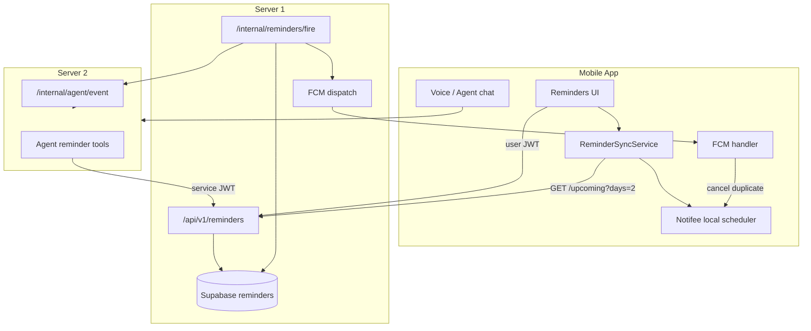
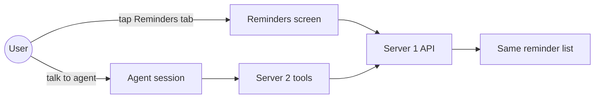
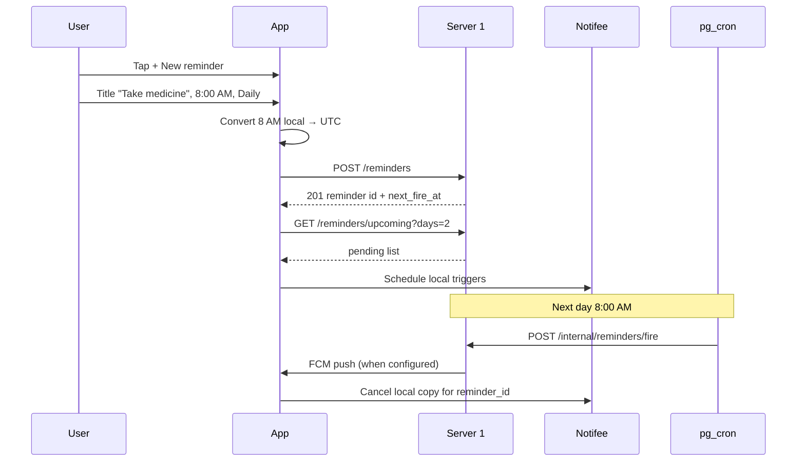
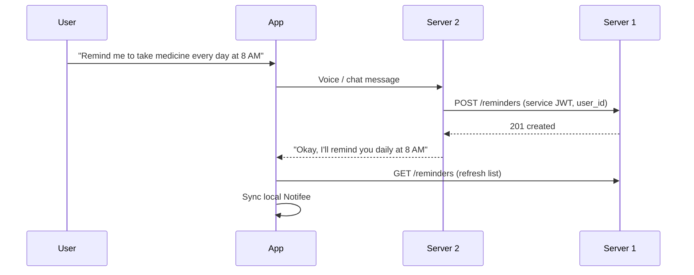
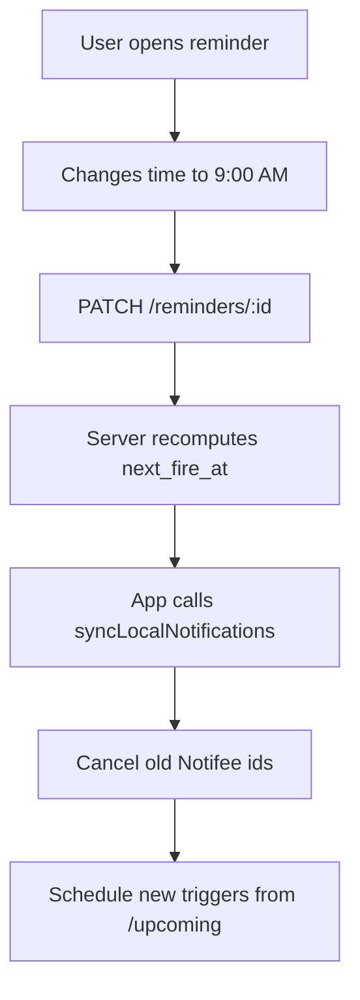
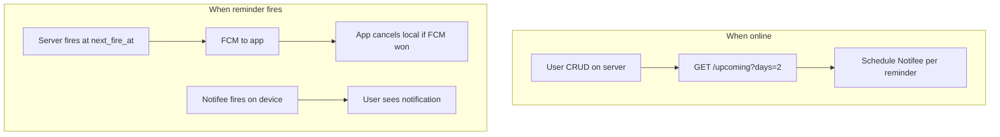
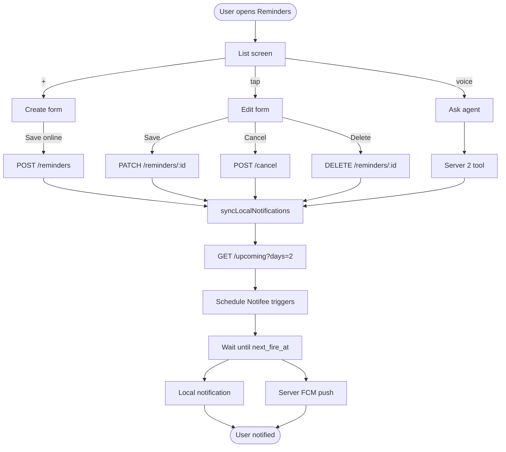

# Mobile App — Reminders Feature Plan

**Version:** 1.0  
**Status:** Planning — ready for mobile implementation  
**Last updated:** 2026-06-07  

**Related docs:**
- Server API (user JWT): this file  
- Server API (agent / Server 2): [`doc/REMINDERS_AGENT_TOOL_SPEC.md`](REMINDERS_AGENT_TOOL_SPEC.md)  
- Auth & tokens: [`doc/MOBILE_APP_AUTH_SPEC.md`](MOBILE_APP_AUTH_SPEC.md)  
- Backend architecture: [`PLAN.md`](../PLAN.md) v1.9 Phase 3B  

---

## 1. Goal

Give users full control over reminders from the mobile app:

- Create, view, edit, cancel, and delete reminders from a **Reminders UI**
- Also create/manage via **voice agent** (same data on server)
- Receive notifications when reminders fire (FCM when online + **Notifee** local backup for near-term offline reliability)
- Keep **server as source of truth**; phone mirrors the next 2 days locally

---

## 2. Architecture overview



### Responsibility split

| Layer | Owns |
|---|---|
| **Server 1** | Storage, scheduling, recurrence, firing, FCM push |
| **Server 2** | Natural-language create/update/cancel via agent tools |
| **Mobile UI** | Screens, forms, list, user actions |
| **Mobile sync** | Fetch upcoming → schedule Notifee on device |
| **Notifee** | Offline-capable local notifications (next ~2 days) |
| **FCM** | Server-triggered push when online |

---

## 3. User entry points

Users can manage reminders in **two ways** — both read/write the same server data.



| Entry | UX | Backend |
|---|---|---|
| **Reminders tab** | List, +, edit, swipe delete | App → `Authorization: Bearer <user_access_token>` |
| **Voice agent** | “Remind me at 8pm for medicine” | Server 2 → service JWT → same API |

After agent creates a reminder, the app list should refresh and show it (pull-to-refresh, focus listener, or silent push later).

---

## 4. Screens & navigation

### 4.1 Navigation structure

```
Main app
 └── Reminders (tab or menu item)
      ├── RemindersListScreen
      ├── ReminderDetailScreen (optional)
      └── ReminderFormScreen (create / edit)
```

### 4.2 RemindersListScreen

**Purpose:** See and manage all reminders.

| UI element | Behavior |
|---|---|
| **+ button** | Open ReminderFormScreen (create) |
| **List rows** | Title, next fire time (local), repeat badge, source chip (You / Agent) |
| **Tap row** | Open edit form or detail |
| **Swipe left → Delete** | `DELETE /reminders/:id` + cancel local Notifee |
| **Swipe right → Cancel** | `POST /reminders/:id/cancel` (preferred over delete) |
| **Pull to refresh** | `GET /reminders?status=pending` + sync local |
| **Empty state** | “No reminders” + CTA to add or ask agent |
| **Filter chips** | Active · Completed · All |

**Row status display:**

| Server `status` | Show as |
|---|---|
| `pending` | Active — show `next_fire_at` in user timezone |
| `snoozed` | Snoozed — show new time |
| `fired` | Completed (one-time) |
| `cancelled` | Cancelled / inactive |

### 4.3 ReminderFormScreen (create & edit)

| Field | Type | Required | Maps to API |
|---|---|---|---|
| Title | Text input | Yes | `title` |
| Notes | Multiline | No | `body` |
| Date | Date picker | Yes | part of `remind_at` |
| Time | Time picker | Yes | part of `remind_at` |
| Repeat | Segmented: None · Daily · Weekly · Monthly | No | `recurrence` |
| End repeat | Optional: never / after N times | No | `max_fire_count` |
| Timezone | Auto from device | Yes | `timezone` (IANA, e.g. `America/New_York`) |

**Buttons:**
- **Save** → `POST /` (create) or `PATCH /:id` (edit)
- **Cancel reminder** (edit only) → `POST /:id/cancel`
- **Delete** (edit only, confirm dialog) → `DELETE /:id`

**Do not send `user_id`** — server uses the logged-in user from JWT.

### 4.4 Notification actions (when reminder fires)

When user taps the notification or uses action buttons:

| Action | API | Local |
|---|---|---|
| **Open** | Navigate to reminder detail | — |
| **Snooze 10 min** | `POST /:id/snooze` `{ "minutes": 10 }` | Reschedule Notifee |
| **Done / Dismiss** | For one-time: optional `cancel`; recurring: no-op (server advances) | Cancel local |

---

## 5. Example flows

### 5.1 Medicine daily at 8 AM (from app UI)



**Request body (create):**
```json
{
  "title": "Take medicine",
  "body": "Vitamin D with breakfast",
  "remind_at": "2026-06-08T13:00:00.000Z",
  "timezone": "America/New_York",
  "recurrence": "daily"
}
```

### 5.2 Same reminder via voice agent



User sees the same row in Reminders list with `source: "agent"`.

### 5.3 Edit time from app



### 5.4 Cancel / delete

| User intent | Prefer | API |
|---|---|---|
| Stop future fires, keep history | **Cancel** | `POST /:id/cancel` |
| Remove completely | **Delete** | `DELETE /:id` |

After either: run `syncLocalNotifications()` to remove local schedules for that `reminder_id`.

---

## 6. Server vs local — sync model

### 6.1 Principle

```
Server = source of truth (all CRUD)
Local  = mirror for next 2 days only (offline backup)
```



### 6.2 When to sync local notifications

Call `syncLocalNotifications()` after:

| Event | Action |
|---|---|
| App launch (logged in) | Fetch upcoming + reschedule |
| App returns to foreground | Same |
| NetInfo: back online | Same |
| After create / edit / cancel / delete | Same |
| After snooze | Reschedule that reminder only |
| On FCM `reminder.fired` | Cancel local for `reminder_id` |

### 6.3 Sync algorithm (pseudocode)

```typescript
async function syncLocalNotifications() {
  // 1. Fetch server upcoming window
  const { reminders } = await api.get("/reminders/upcoming?days=2");

  // 2. Cancel all locally tracked reminder triggers
  await notifee.cancelTriggerNotifications(
    localStore.getAllReminderTriggerIds()
  );

  // 3. Schedule one Notifee trigger per pending occurrence
  for (const r of reminders) {
    const triggerId = `reminder:${r.id}`;
    await notifee.createTriggerNotification(
      {
        id: triggerId,
        title: r.title,
        body: r.body ?? r.title,
        data: { type: "reminder", reminder_id: r.id },
        android: { channelId: "reminders" },
      },
      {
        type: TriggerType.TIMESTAMP,
        timestamp: new Date(r.next_fire_at).getTime(),
      }
    );
    localStore.saveTriggerId(r.id, triggerId);
  }
}
```

For **daily recurring** reminders within the 2-day window, schedule the **next** occurrence only; re-sync after fire or on next app open.

### 6.4 Deduplication (avoid double notification)

| Scenario | Rule |
|---|---|
| FCM arrives before local fires | Cancel local trigger for that `reminder_id` |
| Offline, local fires | Show Notifee notification; on reconnect, server may have fired too — use `fire_count` / `fired_at` to avoid duplicate UI toasts |
| User snoozed on server | Local must match new `next_fire_at` after sync |

### 6.5 Offline behavior (v1 recommendation)

| Action | Offline v1 |
|---|---|
| View list | Show cached list from last fetch (optional AsyncStorage cache) |
| Create / edit / delete | **Require online** — show “Connect to internet” |
| Fire at scheduled time | **Local Notifee still works** for already-synced upcoming reminders |

Offline create queue can be a **v2** enhancement.

---

## 7. Reminder vs alarm

| | Server reminder | Local alarm |
|---|---|---|
| **Use for** | Medicine, tasks, agent-aware nudges | Wake-up, must ring with no network |
| **Stored on** | Server 1 | Device only (optional v2) |
| **Agent knows** | Yes | No |
| **Cross-device** | Yes | No |
| **Accuracy** | ~1 minute (cron) | Exact |

**v1 scope:** All reminders in this feature use the **server reminder** model + Notifee mirror. Dedicated “Alarm clock” UI (local-only) can be a separate v2 screen.

---

## 8. API reference (mobile — user JWT)

**Base:** `{API_URL}/api/v1/reminders`  
**Header:** `Authorization: Bearer <access_token>`

| Action | Method | Path | Body |
|---|---|---|---|
| List | GET | `/` | Query: `status`, `source`, `from`, `to`, `limit`, `cursor` |
| Upcoming (sync) | GET | `/upcoming` | Query: `days` (default 2, max 14) |
| Get one | GET | `/:id` | — |
| Create | POST | `/` | See below |
| Update | PATCH | `/:id` | Partial fields |
| Cancel | POST | `/:id/cancel` | `{}` |
| Delete | DELETE | `/:id` | — |
| Snooze | POST | `/:id/snooze` | `{ "minutes": 10 }` |

**Create body (mobile — no `user_id`):**
```json
{
  "title": "Take medicine",
  "body": "Optional notes",
  "remind_at": "2026-06-08T13:00:00.000Z",
  "timezone": "America/New_York",
  "recurrence": "daily",
  "max_fire_count": null
}
```

**`recurrence` values:** `null` (one-time) · `daily` · `weekly` · `monthly` · `custom` (requires `rrule`)

**Response shape:** `{ "reminder": { "id", "title", "next_fire_at", "status", "source", ... } }`

Full field list: [`doc/REMINDERS_AGENT_TOOL_SPEC.md`](REMINDERS_AGENT_TOOL_SPEC.md).

---

## 9. Push notifications (FCM)

### 9.1 Register token (already in auth flow)

On login, register device token:

```
POST /api/v1/notifications/push-token
{ "token": "<fcm_token>", "platform": "ios" | "android" }
```

### 9.2 Incoming reminder push

When server fires, FCM payload includes:

```json
{
  "data": {
    "type": "reminder.fired",
    "reminder_id": "uuid"
  },
  "notification": {
    "title": "Take medicine",
    "body": "Vitamin D with breakfast"
  }
}
```

**Handler:**
1. Show notification (if app in background)
2. Cancel local Notifee trigger for `reminder_id`
3. Refresh list if Reminders screen is open
4. Optional: deep link to reminder detail

### 9.3 Foreground

Use Notifee to display a heads-up notification when app is open and FCM data message arrives.

---

## 10. Timezone rules

1. **Always send IANA timezone** from device: `Intl.DateTimeFormat().resolvedOptions().timeZone`
2. **Convert local picker → UTC** before `remind_at` in API
3. **Display** using `next_fire_at` + stored `timezone` (or device tz)
4. **DST:** Server stores UTC; client handles display shifts

```typescript
// Example: user picks June 8, 2026 8:00 AM in America/New_York
const remindAt = dayjs.tz("2026-06-08 08:00", "America/New_York").toISOString();
// → "2026-06-08T12:00:00.000Z" (or offset per DST)
```

Use `dayjs` + `dayjs/plugin/timezone` or `luxon` in React Native.

---

## 11. Suggested mobile module structure

```
src/
├── features/
│   └── reminders/
│       ├── screens/
│       │   ├── RemindersListScreen.tsx
│       │   └── ReminderFormScreen.tsx
│       ├── components/
│       │   ├── ReminderListItem.tsx
│       │   └── RepeatPicker.tsx
│       ├── api/
│       │   └── remindersApi.ts          # wraps /api/v1/reminders
│       ├── hooks/
│       │   ├── useReminders.ts
│       │   └── useReminderSync.ts
│       ├── services/
│       │   ├── reminderSyncService.ts   # upcoming → Notifee
│       │   └── reminderLocalStore.ts    # trigger id map
│       └── types/
│           └── reminder.ts
├── notifications/
│   ├── fcm.ts                           # @react-native-firebase/messaging
│   ├── notifeeSetup.ts                  # channels, permissions
│   └── handleReminderPush.ts
```

---

## 12. Dependencies (React Native)

```bash
npm install @notifee/react-native
npm install @react-native-firebase/app @react-native-firebase/messaging
npm install @react-native-community/netinfo
npm install dayjs
# optional: zustand or react-query for list state
```

**Android:** Create Notifee channel `reminders` on app start.  
**iOS:** Request notification permission on first Reminders visit or onboarding.

---

## 13. Implementation phases

### Phase A — Core UI (online only)

- [ ] `remindersApi.ts` — all CRUD calls with auth refresh
- [ ] RemindersListScreen + ReminderFormScreen
- [ ] Create / edit / cancel / delete wired to API
- [ ] Timezone + UTC conversion
- [ ] Pull-to-refresh list

**Done when:** User can manage medicine-style daily reminder entirely from UI while online.

### Phase B — Local sync (offline fire)

- [ ] Notifee setup + Android channel
- [ ] `reminderSyncService.ts` — `/upcoming?days=2` → schedule triggers
- [ ] Sync on launch, foreground, reconnect, after CRUD
- [ ] Local store mapping `reminder_id` → Notifee trigger id

**Done when:** Airplane mode after sync still fires local notification at scheduled time.

### Phase C — FCM integration

- [ ] Register push token on login (if not already)
- [ ] Handle `reminder.fired` — display + dedup local
- [ ] Notification actions: snooze, open

**Done when:** Online users get server push; no duplicate with local.

### Phase D — Agent polish

- [ ] Refresh list when returning from agent session
- [ ] Show `source: agent` badge on rows
- [ ] Agent-created reminders appear without manual refresh (polling or websocket later)

**Done when:** Voice-created reminders visible in UI immediately after agent confirms.

---

## 14. UX copy examples

| Context | Copy |
|---|---|
| Empty list | “No reminders yet. Add one or ask Vayumi to remind you.” |
| Offline create | “You’re offline. Connect to the internet to create a reminder.” |
| Daily repeat badge | “Every day” |
| Agent source | “Created by Vayumi” |
| Cancel confirm | “Stop this reminder? It won’t fire again.” |
| Delete confirm | “Delete this reminder permanently?” |

---

## 15. Testing checklist

| # | Test | Expected |
|---|---|---|
| 1 | Create one-time reminder 2 min ahead | Fires, `status` → `fired` on server |
| 2 | Create daily medicine 8 AM | Repeats, `next_fire_at` advances |
| 3 | Edit time | New time used, local rescheduled |
| 4 | Cancel | No more fires, local cancelled |
| 5 | Snooze 10 min | `status=snoozed`, fires later |
| 6 | Sync + airplane mode | Local Notifee fires at time |
| 7 | Online fire | FCM received, no duplicate local |
| 8 | Agent creates reminder | Appears in list with `source=agent` |
| 9 | Timezone DST edge | Display time matches user expectation |

---

## 16. Out of scope (v1)

- Offline create queue
- Local-only alarm clock screen
- Custom RRULE UI (use daily/weekly/monthly only in v1)
- Web app reminders UI (same API, separate project)
- Widget / Live Activity

---

## 17. Backend prerequisites

Before shipping mobile reminders:

- [x] Server 1 reminders API deployed
- [x] Supabase `reminders` table migrated
- [ ] `INTERNAL_REMINDER_SECRET` + pg_cron configured (or node-cron on server)
- [ ] Valid `FCM_SERVICE_ACCOUNT_PATH` on Server 1
- [ ] `SERVER2_INTERNAL_URL` for agent speak-on-fire (optional for UI-only v1)
- [ ] Server 2 agent tools per [`REMINDERS_AGENT_TOOL_SPEC.md`](REMINDERS_AGENT_TOOL_SPEC.md)

---

## 18. Quick reference diagram



---

*End of mobile reminders plan.*
