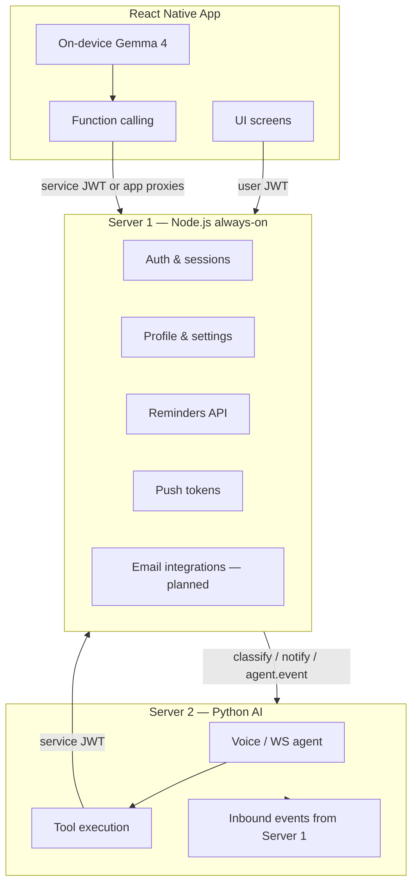
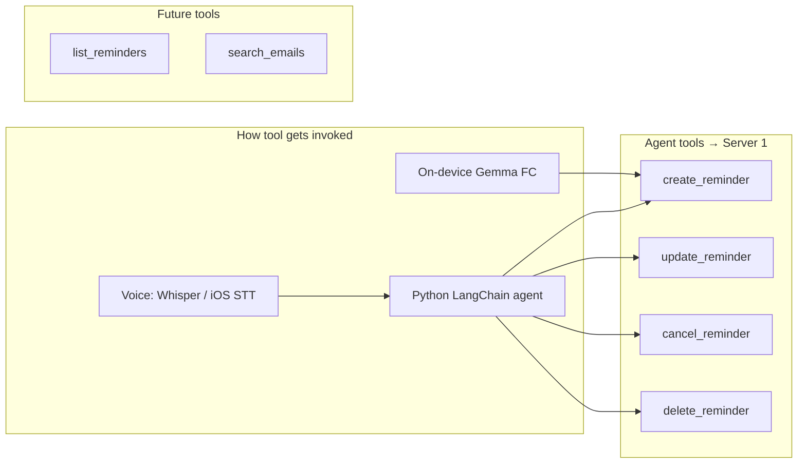

# Server 1 — Complete API Catalog & Agent Tools Map

**Version:** 1.0  
**Last updated:** 2026-06-07  
**Base URL:** `{SERVER1_URL}/api/v1`  
**Internal base:** `{SERVER1_URL}/internal`  

**Related:**
- Mobile auth details: [`MOBILE_APP_AUTH_SPEC.md`](MOBILE_APP_AUTH_SPEC.md)
- Mobile reminders UI: [`MOBILE_REMINDERS_UI_SPEC.md`](MOBILE_REMINDERS_UI_SPEC.md)
- Agent reminder tools: [`REMINDERS_AGENT_TOOL_SPEC.md`](REMINDERS_AGENT_TOOL_SPEC.md)
- Architecture source of truth: [`PLAN.md`](../PLAN.md) v1.9

---

## 1. How Server 1 fits your app architecture



**Simple rule (matches your plan):**

| Server | Role |
|---|---|
| **Server 1 (Node)** | Identity, data, scheduling, push tokens, integrations — **no AI** |
| **Server 2 (Python)** | Voice, STT, TTS, agent reasoning, tool orchestration |
| **On-device LLM** | Offline chat, multimodal, function calling → calls Server 1 for tools |

---

## 2. Feature completeness — what exists today

### ✅ Fully working (mobile + agent can use now)

| Feature area | Endpoints | Mobile | Agent tool |
|---|---|---|---|
| Health check | `GET /health` | Optional | No |
| Register / login / Google | `/auth/*` | Yes | No |
| Token refresh / logout | `/auth/*` | Yes | No |
| Password reset / change | `/auth/password/*` | Yes | No |
| Current user (`/auth/me`) | `GET /auth/me` | Yes | No |
| Session list / revoke | `/sessions/*` | Yes | No |
| User profile | `/users/profile` | Yes | No |
| Avatar upload | `POST /users/avatar` | Yes | No |
| Account delete | `DELETE /users/account` | Yes | No |
| App settings | `/settings/*` | Yes | No |
| Push token register/remove | `/notifications/push-token` | Yes | No |
| **Reminders CRUD + fire** | `/reminders/*` | Yes | **Yes** |
| Integrations list | `GET /integrations` | Yes | Future |

### ⚠️ Partial / stub

| Feature | Status |
|---|---|
| Gmail connect | `GET /integrations/gmail/connect` → **501 stub** |
| Outlook connect | `GET /integrations/outlook/connect` → **501 stub** |
| FCM push on reminder fire | Code exists; needs real `FCM_SERVICE_ACCOUNT_PATH` |
| Email pipeline backend | Schemas + `processIncomingEmail()` built; **no user API yet** |

### ⬜ Planned in PLAN.md — not mounted yet

| Feature | Endpoints (future) |
|---|---|
| Gmail/Outlook OAuth full flow | `/integrations/gmail/*`, `/integrations/outlook/*` |
| Email search & actions | `/emails/*` |
| Full push dispatch (email fallback) | extends notifications module |
| APNS provider | Phase 4 |

### ❌ In your app vision but NOT on Server 1 yet

| Your v1 plan item | Server 1 status | Notes |
|---|---|---|
| **Life custom tabs** (medicine, spending, subs) | **Planned** | See [`LIFE_TABS_FEATURE_PLAN.md`](LIFE_TABS_FEATURE_PLAN.md) — `/api/v1/life/*` |
| Model download presigned URLs | **Not built** | Needs new module (e.g. `/models/download`) |
| Timers (separate from reminders) | **Not built** | Use reminders API for now, or add `/timers` later |
| Session / chat history storage | **Not built** | On-device or future Server 1 module |
| Billing | **Not built** | Later |
| URL fetch for link reading | **Not built** | Could be Server 1 proxy or on-device only |

---

## 3. Authentication model

### 3.1 User JWT (mobile app)

```
Authorization: Bearer <access_token>
```

- RS256, 15 min expiry
- Payload: `sub` (user id), `sid` (session id), `jti`, `device_type`, `scopes`
- Refresh via `POST /auth/token/refresh` with `refresh_token` from secure storage

### 3.2 Service JWT (Server 2 agent tools)

```
Authorization: Bearer <service_jwt>
```

- Signed with same `JWT_PRIVATE_KEY`
- Payload: `{ "scope": "internal", "iss": "server1" }` — no expiry
- Used on reminder create/update/delete/cancel
- **Must include `user_id` in body** — no session context

### 3.3 Internal secret (infrastructure only)

```
X-Internal-Secret: <INTERNAL_REMINDER_SECRET>
```

- Only for `POST /internal/reminders/fire` (Supabase pg_cron)
- **Not** for agent tools or mobile app

---

## 4. Complete endpoint list

**Legend:**  
✅ Live · ⚠️ Stub · ⬜ Planned · 🔧 Internal  

| Auth | Meaning |
|---|---|
| **None** | Public |
| **User** | User access JWT |
| **User or Service** | User JWT or service JWT |
| **HMAC** | `X-Internal-Secret` header |

---

### 4.1 Health

| Method | Path | Auth | Status | Purpose |
|---|---|---|---|---|
| GET | `/api/v1/health` | None | ✅ | Liveness check |

**Mobile:** Optional startup ping.  
**Agent:** No.

---

### 4.2 Auth — `/api/v1/auth`

| Method | Path | Auth | Status | Purpose |
|---|---|---|---|---|
| POST | `/register` | None | ✅ | Email+password signup, creates session + tokens |
| POST | `/login` | None | ✅ | Email+password login |
| POST | `/google` | None | ✅ | Google Sign-In via `id_token` |
| POST | `/verify-email/confirm` | User | ✅ | Verify email with 6-digit code (logged in) |
| POST | `/verify-email/confirm/request` | None | ✅ | Verify email with 6-digit code by email (not logged in) |
| POST | `/verify-email/resend` | User | ✅ | Resend verification code (logged in) |
| POST | `/verify-email/resend/request` | None | ✅ | Resend verification code by email (not logged in) |
| POST | `/token/refresh` | None | ✅ | Rotate access + refresh tokens |
| POST | `/logout` | User | ✅ | Revoke current session |
| POST | `/logout/all` | User | ✅ | Revoke all sessions |
| POST | `/password/forgot` | None | ✅ | Send reset email |
| POST | `/password/reset` | None | ✅ | Reset with token from email |
| POST | `/password/change` | User | ✅ | Change password while logged in |
| GET | `/me` | User | ✅ | Current user + identities |

#### Key request bodies

**Register / Login / Google** — include device info:
```json
{
  "email": "user@example.com",
  "password": "...",
  "name": "Optional",
  "device_type": "mobile_ios",
  "device_name": "iPhone 15 Pro",
  "device_fingerprint": "optional"
}
```

**Google:**
```json
{
  "id_token": "...",
  "device_type": "mobile_android",
  "device_name": "Pixel 8"
}
```

**Verify email confirm (logged in) / confirm/request (not logged in):**
```json
{
  "email": "user@example.com",
  "code": "123456"
}
```
`/verify-email/confirm` (authenticated) only needs `{ "code": "123456" }`. Codes are 6 digits,
expire after 10 minutes, and lock out after 5 incorrect attempts (`TOO_MANY_ATTEMPTS`, requires a
resend). Resend endpoints enforce a 60s cooldown per user.

**Refresh:**
```json
{ "refresh_token": "opaque_refresh_token" }
```

**Token response shape:**
```json
{
  "user": { "id", "email", "name", "avatar_url", "is_verified", ... },
  "tokens": {
    "access_token": "eyJ...",
    "refresh_token": "...",
    "expires_in": 900
  }
}
```

**Mobile features:** Onboarding, login, Google sign-in, session lifecycle.  
**Agent tools:** None — auth is always app-driven.

---

### 4.3 Sessions — `/api/v1/sessions`

| Method | Path | Auth | Status | Purpose |
|---|---|---|---|---|
| GET | `/` | User | ✅ | List active sessions for current user |
| DELETE | `/:sessionId` | User | ✅ | Revoke one session (remote logout) |

**Mobile:** “Where you’re logged in” settings screen.  
**Agent:** No.

---

### 4.4 Users (profile) — `/api/v1/users`

| Method | Path | Auth | Status | Purpose |
|---|---|---|---|---|
| GET | `/profile` | User | ✅ | Get profile |
| PATCH | `/profile` | User | ✅ | Update `name`, `avatar_url` |
| POST | `/avatar` | User | ✅ | Upload image → Supabase Storage → sets avatar URL |
| DELETE | `/account` | User | ✅ | Soft-delete account |

**PATCH body:**
```json
{ "name": "Dharam", "avatar_url": "https://..." }
```

**Avatar:** `multipart/form-data`, field `avatar`.

**Mobile:** Profile screen, edit name, photo picker.  
**Agent:** No (v1). Future: `update_profile` tool possible.

---

### 4.5 Settings — `/api/v1/settings`

| Method | Path | Auth | Status | Purpose |
|---|---|---|---|---|
| GET | `/` | User | ✅ | Get all settings buckets |
| PATCH | `/notifications` | User | ✅ | Merge into `notifications` JSON |
| PATCH | `/privacy` | User | ✅ | Merge into `privacy` JSON |
| PATCH | `/appearance` | User | ✅ | Merge into `appearance` JSON |

**Response shape:**
```json
{
  "settings": {
    "notifications": {},
    "privacy": {},
    "appearance": {},
    "updated_at": "..."
  }
}
```

PATCH bodies are flexible key-value merges (any JSON keys you define in the app).

**Mobile:** Settings screens (theme, notification prefs, privacy toggles).  
**Agent:** No (v1).

**Note:** Settings schema is open JSON — define your app’s keys (e.g. `voice_enabled`, `theme: "dark"`) in the mobile app; Server 1 stores them as-is.

---

### 4.6 Notifications (push tokens) — `/api/v1/notifications`

| Method | Path | Auth | Status | Purpose |
|---|---|---|---|---|
| POST | `/push-token` | User | ✅ | Register FCM/APNs token for this user+session |
| DELETE | `/push-token` | User | ✅ | Remove token (call before logout) |

**Register body:**
```json
{
  "token": "fcm_or_apns_device_token",
  "platform": "ios"
}
```

`platform`: `ios` | `android`

**Mobile:** On login + FCM token refresh; delete before logout.  
**Agent:** No.

**Reminder firing:** Server 1 uses stored tokens to send FCM when reminders fire (when FCM is configured).

---

### 4.7 Reminders — `/api/v1/reminders` ✅

| Method | Path | Auth | Status | Purpose |
|---|---|---|---|---|
| POST | `/` | User or Service | ✅ | Create reminder |
| GET | `/` | User | ✅ | List with filters |
| GET | `/upcoming` | User | ✅ | Next N days — offline Notifee sync |
| GET | `/:id` | User | ✅ | Get one |
| PATCH | `/:id` | User or Service | ✅ | Update |
| DELETE | `/:id` | User or Service | ✅ | Hard delete |
| POST | `/:id/snooze` | User | ✅ | Snooze N minutes |
| POST | `/:id/cancel` | User or Service | ✅ | Soft cancel |

**Create (mobile — no `user_id`):**
```json
{
  "title": "Take medicine",
  "body": "Vitamin D",
  "remind_at": "2026-06-08T13:00:00.000Z",
  "timezone": "America/New_York",
  "recurrence": "daily",
  "max_fire_count": null
}
```

**Create (agent — requires `user_id`):**
```json
{
  "user_id": "uuid",
  "title": "Call mum",
  "remind_at": "2026-06-08T22:00:00.000Z",
  "timezone": "America/New_York"
}
```

**List query params:** `status`, `source`, `from`, `to`, `limit`, `cursor`  
**Upcoming:** `?days=2` (default 2, max 14)

**Mobile:** Reminders tab — see [`MOBILE_REMINDERS_UI_SPEC.md`](MOBILE_REMINDERS_UI_SPEC.md).  
**Agent:** Primary tool surface for scheduling — see Section 5.

---

### 4.8 Integrations — `/api/v1/integrations`

| Method | Path | Auth | Status | Purpose |
|---|---|---|---|---|
| GET | `/` | User | ✅ | List connected providers (gmail/outlook) |
| GET | `/gmail/connect` | User | ⚠️ 501 | OAuth start — not wired |
| GET | `/gmail/callback` | None | ⬜ | OAuth callback |
| DELETE | `/gmail` | User | ⬜ | Disconnect Gmail |
| POST | `/gmail/webhook` | HMAC | ⬜ | Gmail Pub/Sub |
| GET | `/outlook/connect` | User | ⚠️ 501 | OAuth start — not wired |
| GET | `/outlook/callback` | None | ⬜ | OAuth callback |
| DELETE | `/outlook` | User | ⬜ | Disconnect Outlook |
| POST | `/outlook/webhook` | None | ⬜ | Graph notifications |

**Mobile:** “Connect email” settings (future).  
**Agent:** Future tools for email search once `/emails` ships.

---

### 4.9 Emails — `/api/v1/emails` ⬜ (not mounted)

| Method | Path | Auth | Status | Purpose |
|---|---|---|---|---|
| GET | `/` | User | ⬜ | Smart search synced emails |
| GET | `/:id` | User | ⬜ | Email metadata + snippet |
| GET | `/:id/body` | User | ⬜ | Live full body from provider |
| POST | `/sync` | User | ⬜ | Manual delta sync |
| PATCH | `/:id/read` | User | ⬜ | Mark read |
| PATCH | `/:id/star` | User | ⬜ | Star / unstar |

**Agent:** Future — read emails, summarize, act on urgent mail.

---

### 4.10 Internal (not for app) — `/internal`

| Method | Path | Auth | Status | Purpose |
|---|---|---|---|---|
| POST | `/reminders/fire` | HMAC | ✅ | Process due reminders (pg_cron / node-cron) |

---

## 5. AI agent tools map

Agent tools = Server 2 (or on-device Gemma function calling) calling Server 1 APIs with **service JWT**.



### 5.1 v1 agent tools (ready now)

| Tool name | HTTP | When to use | Key body fields |
|---|---|---|---|
| `create_reminder` | `POST /reminders` | “Remind me at 6pm”, “every day take medicine” | `user_id`, `title`, `remind_at`, `timezone`, `recurrence?` |
| `update_reminder` | `PATCH /reminders/:id` | “Move my 6pm reminder to 7pm” | `remind_at`, `title`, `recurrence?` |
| `cancel_reminder` | `POST /reminders/:id/cancel` | “Cancel that reminder” | — |
| `delete_reminder` | `DELETE /reminders/:id` | “Remove it completely” | — |

**On-device Gemma function calling example (Flow B in your plan):**

```json
{
  "name": "create_reminder",
  "arguments": {
    "title": "Call mum",
    "remind_at": "2026-06-08T22:00:00.000Z",
    "timezone": "America/New_York",
    "recurrence": null
  }
}
```

App receives FC → adds `user_id` from logged-in user → calls Server 1 with **user JWT** (app proxy) **or** Server 2 calls with **service JWT**.

**Recommended v1 pattern (on-device, Tier 1):**

```
Gemma function call → App tool handler → POST /reminders (user JWT)
```

No Python server needed. Same API, simpler auth.

**Python server pattern (Tier 2+):**

```
LangChain tool → POST /reminders (service JWT + user_id)
```

### 5.2 User-only endpoints (not agent tools)

| Endpoint | Why user-only |
|---|---|
| `GET /reminders`, `GET /reminders/upcoming` | Agent listing needs service JWT + `user_id` query — **not built yet**; app uses user JWT |
| `POST /reminders/:id/snooze` | UX action from notification tap |
| All `/auth`, `/sessions`, `/users`, `/settings` | User identity & prefs |
| `/notifications/push-token` | Device registration |

### 5.3 Timers vs reminders

| Concept | Server 1 today |
|---|---|
| **Reminder** | ✅ `/api/v1/reminders` — persisted, recurring, agent-aware |
| **Timer** (e.g. “5 minutes”) | ❌ No `/timers` API |

**v1 workaround for timers:**

- One-time reminder with `remind_at = now + 5 minutes`, `recurrence: null`
- Or local-only timer in app (Notifee) without server — good for short countdowns offline

**Future:** optional `POST /timers` for ephemeral countdowns if you want them separate from reminders.

---

## 6. Server 1 → Server 2 calls (inbound to Python)

Server 1 **calls** Server 2. These are not mobile endpoints — implement on Python.

| Call | When | Body highlight |
|---|---|---|
| `POST /internal/emails/classify` | New email in pipeline | masked subject/body → category, keywords |
| `POST /internal/emails/notify` | Email saved | `userId`, `emailId`, summary → `{ handled: true/false }` |
| `POST /internal/agent/event` | Reminder fired / cancelled | `type: "reminder.fired"`, `userId`, `payload` |

**Your Python server should implement:**

```python
POST /internal/agent/event
# Handle types:
#   reminder.fired   → speak to user if in session
#   reminder.cancelled → optional
#   email.received   → future unified handler
```

---

## 7. Mobile app screen → API map

| App screen / flow | Endpoints used |
|---|---|
| **Onboarding / Login** | `POST /auth/register`, `/login`, `/google` |
| **Silent refresh** | `POST /auth/token/refresh` |
| **Home / account** | `GET /auth/me` |
| **Profile** | `GET/PATCH /users/profile`, `POST /users/avatar` |
| **Settings** | `GET /settings`, `PATCH /settings/{notifications,privacy,appearance}` |
| **Sessions / security** | `GET /sessions`, `DELETE /sessions/:id`, `POST /auth/logout/all` |
| **Push setup** | `POST /notifications/push-token` |
| **Logout** | `DELETE /notifications/push-token` → `POST /auth/logout` |
| **Reminders list** | `GET /reminders?status=pending` |
| **Add / edit reminder** | `POST /reminders`, `PATCH /reminders/:id` |
| **Cancel / delete** | `POST /reminders/:id/cancel`, `DELETE /reminders/:id` |
| **Offline sync** | `GET /reminders/upcoming?days=2` |
| **Voice “set reminder”** | Gemma FC → `POST /reminders` |
| **Connect Gmail** (future) | `GET /integrations/gmail/connect` |

---

## 8. Tier mapping — your v1 launch plan

| Your Tier 1 feature | Server 1 role | Status |
|---|---|---|
| Text chat with AI | None (on-device) | N/A |
| Image / audio in chat | None (on-device) | N/A |
| Voice chat basic | None (on-device STT/TTS) | N/A |
| **Reminders via voice** | `POST /reminders` | ✅ Ready |
| **Timers** | Use reminders or local Notifee | ⚠️ No dedicated API |
| Wake word | None (on-device ONNX) | N/A |
| Meeting notes | None (on-device Gemma) | N/A |
| Offline AI | None (on-device) | N/A |
| **Login / account** | `/auth/*`, `/users/*` | ✅ Ready |
| **Push notifications** | `/notifications/push-token` + FCM on fire | ⚠️ FCM config needed |
| Model download URLs | **Not on Server 1** | ❌ Build new endpoint |
| Link reading | **Not on Server 1** | ❌ App or future proxy |

| Your Tier 2 feature | Server 1 role |
|---|---|
| Full voice agent | Server 2; tools still hit Server 1 |
| Email in agent | `/emails/*` + integrations (future) |
| ESP32 hardware | Server 2 WS |

---

## 9. Suggested on-device function definitions (Gemma)

For Tier 1 voice/chat tool use without Python:

```typescript
const tools = [
  {
    name: "create_reminder",
    description: "Schedule a reminder for the user at a specific time",
    parameters: {
      type: "object",
      properties: {
        title: { type: "string" },
        body: { type: "string" },
        remind_at: { type: "string", description: "ISO 8601 UTC" },
        timezone: { type: "string" },
        recurrence: { type: "string", enum: ["daily", "weekly", "monthly", null] },
      },
      required: ["title", "remind_at", "timezone"],
    },
  },
  {
    name: "cancel_reminder",
    description: "Cancel a reminder by id",
    parameters: {
      type: "object",
      properties: { reminder_id: { type: "string" } },
      required: ["reminder_id"],
    },
  },
  // list_reminders: add when internal list-for-agent route exists
];
```

App handler maps these to the HTTP calls in Section 4.7.

---

## 10. What to build next on Server 1 (for your roadmap)

| Priority | Endpoint / module | Unblocks |
|---|---|---|
| P0 | Configure FCM + `SERVER2_INTERNAL_URL` | Push + agent speak on fire |
| P0 | Supabase pg_cron for `/internal/reminders/fire` | Reliable server-side firing |
| P1 | `GET /internal/reminders?user_id=` (service JWT) | Agent can list reminders |
| P1 | Model download presigned URLs | Your “download Gemma after login” screen |
| P2 | Gmail OAuth + `/emails` | Email features in agent |
| P2 | `POST /timers` (optional) | Clean timer vs reminder split |
| P3 | Chat session history API | Cross-device conversation sync |

---

## 11. Quick reference — all live routes today

```
GET    /api/v1/health

POST   /api/v1/auth/register
POST   /api/v1/auth/login
POST   /api/v1/auth/google
POST   /api/v1/auth/verify-email/confirm
POST   /api/v1/auth/verify-email/confirm/request
POST   /api/v1/auth/verify-email/resend
POST   /api/v1/auth/verify-email/resend/request
POST   /api/v1/auth/token/refresh
POST   /api/v1/auth/logout
POST   /api/v1/auth/logout/all
POST   /api/v1/auth/password/forgot
POST   /api/v1/auth/password/reset
POST   /api/v1/auth/password/change
GET    /api/v1/auth/me

GET    /api/v1/sessions
DELETE /api/v1/sessions/:sessionId

POST   /api/v1/notifications/push-token
DELETE /api/v1/notifications/push-token

GET    /api/v1/users/profile
PATCH  /api/v1/users/profile
POST   /api/v1/users/avatar
DELETE /api/v1/users/account

GET    /api/v1/settings
PATCH  /api/v1/settings/notifications
PATCH  /api/v1/settings/privacy
PATCH  /api/v1/settings/appearance

GET    /api/v1/integrations
GET    /api/v1/integrations/gmail/connect      ⚠️ 501
GET    /api/v1/integrations/outlook/connect     ⚠️ 501

POST   /api/v1/reminders
GET    /api/v1/reminders
GET    /api/v1/reminders/upcoming
GET    /api/v1/reminders/:id
PATCH  /api/v1/reminders/:id
DELETE /api/v1/reminders/:id
POST   /api/v1/reminders/:id/snooze
POST   /api/v1/reminders/:id/cancel

POST   /internal/reminders/fire                  🔧 pg_cron only
```

---

*End of catalog. Update this file when new routes ship.*
